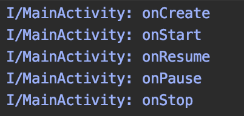

# LifecycleLogger

This library save each lifecycle log.



# Usage

1. Setting `build.gradle`.
2. Bind your Activity or Fragment.
3. Install App!!!

## 1. Setting `build.gradle`.

Add `https://emusute1212.github.io/LifecycleLogger/repository/` to `build.gradle`.


```build.gradle
buildscript {
    // ...
    repositories {
        // ...
        maven {
            url 'https://emusute1212.github.io/LifecycleLogger/repository/'
        }
        
    }
    // ...
}

allprojects {
    repositories {
        // ...
        maven {
            url 'https://emusute1212.github.io/LifecycleLogger/repository/'
        }
    }
}

```

And add `com.github.emusute1212.lifecyclelogger:core:0.1.0.1` to `app/build.gradle`.

```app/build.gradle
dependencies {
    // ...
    implementation "com.github.emusute1212.lifecyclelogger:core:0.1.0.1"
}
```

## 2. Bind your Activity or Fragment.

Call `Logger.bind(lifecycleOwner)` from MainActivity etc.

```MainActivity.kt
    override fun onCreate(savedInstanceState: Bundle?) {
        super.onCreate(savedInstanceState)
        setContentView(R.layout.activity_main)
        Logger.bind(this)
    }
```

## 3. Install App!!!

Install app so finish!!